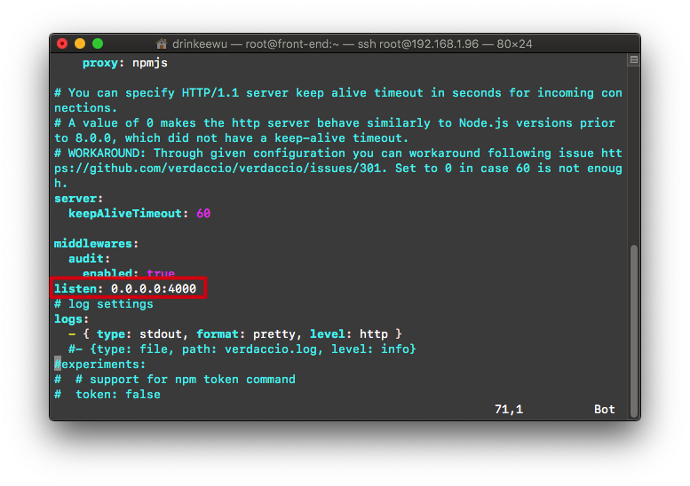
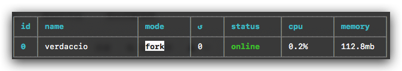
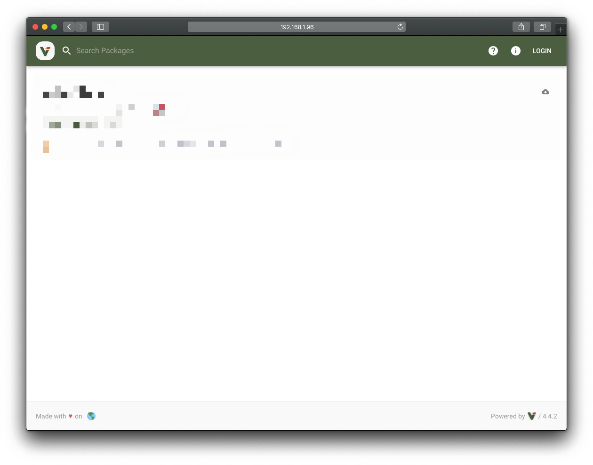
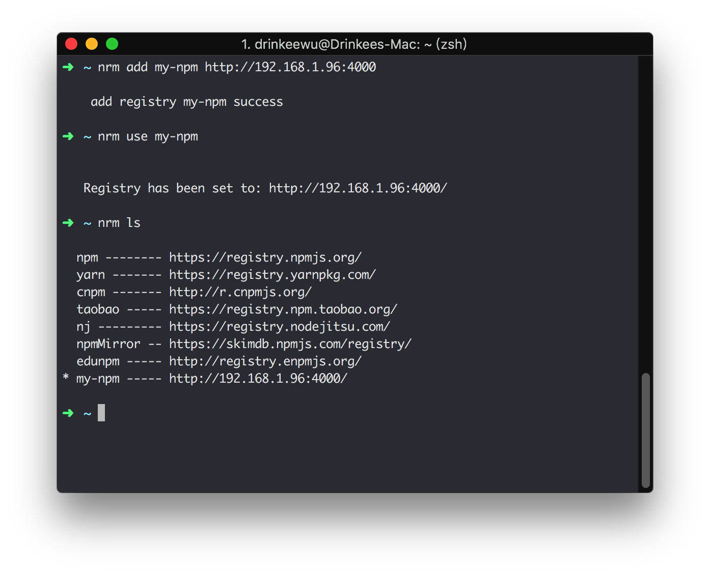

::: tip
公司前段时间为了提高开发效率, 减少重复造轮子, 搭建了一个私有npm组件仓库, 在此总结一下经验。过程中使用了`nrm`、`pm2`、`verdaccio`进行搭建。
:::

<p align="center">
  
  
</p>


<!-- more -->

## 服务器环境搭建
- 服务器系统: `Linux CentoOS 7 x64`
- 运行环境: `Node.js`
- 使用工具库: `nrm`、`pm2`、`verdaccio`、

### 连接到到服务器
```bash
ssh root@192.168.1.80
```
`192.168.1.80` 是组件库所部署的内部服务IP地址

### 安装所需工具库
安装 `Node.js` 环境
```bash
sudo install epel-release
sudo yum install nodejs
```

Linux安装的是旧版本的 `npm` ,这里我们更新一下 `npm` 版本
```bash
sudo npm install npm -g
```
安装依赖环境
```bash
sudo npm install verdaccio pm2 nrm -g
```

- **nrm**: npm源管理器
- **pm2**: 进程守护工具
- **verdaccio**: 运行npm服务器的插件; 支持身份验证、中间件和存储插件


### 配置服务器环境
为了生成`verdaccio`的配置文件, 需要先在服务器根目录用户根目录运行一次`verdaccio`
```bash
verdaccio
```

运行成功之后, 修改`verdaccio`的默认配置文件, 
```bash
yum install vim   #安装vim工具包
vim .config/verdaccio/config.yml  #修改配置
```
在配置文件中添加`listen:0.0.0.0:4000`的配置, 开放`verdaccio`服务器的端口(默认为`4873`)。如下图所示:


修改完成后, 退出并保存。


### 启动**verdaccio**服务
上面我们提到, 启动`verdaccio`服务只需要在终端运行`verdaccio`就可以了。但是如果关闭了终端, `verdaccio`服务就不能一直保持运行了。这个时候我们就需要用到上面安装的`pm2`进行进程守护, 保持`verdaccio`持续运行。

```bash
pm2 start verdaccio
```
pm2运行成功后, 终端会显示下图的提示

::: tip
也可以通过`pm2 ls`命令查看正在运行进程列表。
:::

为了让同一局域网内的其他设备能够访问到`verdaccio`服务器, 还需要开放`Linux`服务器的`4000`端口(`verdaccio`服务运行端口)。

更新`yum`包
```bash
yum -y install yum-utils
```
安装或更新`openssl`
```bash
yum -y install openssl  #安装
yum -y update openssl   #更新
```
启动
```bash
yum-config-manager --enable cr 
yum update
```
开放服务器的 `4000` 端口
```bash
firewall-cmd --permanent --add-port=4000/tcp 
```
重新加载防火墙配置
```bash
firewall-cmd --reload
```

现在, 私有`npm`仓库服务器就已经搭建成功。浏览器访问服务器的地址(这里为`192.168.1.96:4000`), 就可以看到`verdaccio`服务器已经在运行。




## 发布npm包到服务器

### 切换到私有npm源
首先，需要把npm源切换到刚刚添加的地址。为了切换起来更方便，这里我们借助`nrm` 。


添加私有`npm`源到`nrm`管理器

```bash
npm add my-npm http://192.168.1.96:4000
```
- `my-npm`是npm源的别名, 可以根据自己的喜好命名
- `http://192.168.1.96:4000`是私有npm的源地址

使用私有`npm`源

:::tip
添加完私有npm源后, 可通过`nrm ls`命令查看已添加的和当前使用的`npm`源。
:::



### 添加用户
为了把本地的组件库发布到私有`npm`服务器, 这里还需要添加一个登录`npm`服务器的账户。
```bash
npm adduser  #执行完该命令后, 按照提示分别输入用户命、密码和联系邮箱
```

### 发布npm包


修改`package.json`文件里的`version`以修改版本号。或者通过`npm version`命令对版本号进行修改。

:::tip
在终端输入`npm version --help`命令可查看相关说明
:::

进入到组件库源代码的根目录, 登录私有`npm`服务器。
```bash
npm login 
```

发布:
```bash
npm publish
```
等待终端提示发布成功后, 打开浏览器访问服务器地址(此处例子为`http://192.168.1.96:4000`)即可看到新发布的`npm`包了✅


:::warning
执行发布命令前, 需要先通过`npm init`命令生成`package.json`文件。`package.json`上的`name`属性就是当前组件库在`npm`服务器上的包名。
:::

## 在实际开发中引入私有npm包
私有`npm`发布成功后, 只需要像往常一样通过`npm install [package_name]`即可使用对应的`npm`包了。比如包名为`my-table`, 安装方式如下
```bash
npm install my-table
```


**End.**