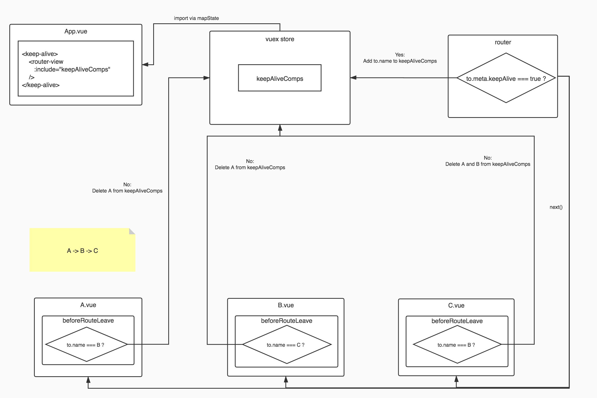

<p align="center">
   
</p>
<!-- more -->

::: tip
在日常开发中, 经常会遇到这样的需求: 跳转到详情页面后, 再返回到列表页时需要恢复到跳转前的滚动位置或页码位置，以提高用户体验。在`Vue`项目中，我们可以是用`keep-alive`组件进行页面进行“缓存”。对于`keep-alive`是什么，这里就不再赘述，本文主要介绍多层（两层或以上）嵌套路由的情况下的实现方案。
:::

[[toc]]

## 基本使用方法

```vue
<template>
  <!-- ... -->
  <keep-alive>
    <router-view />
  </keep-alive>
</template>
```

**参考链接：**

[API keep-alive](<https://cn.vuejs.org/v2/api/#keep-alive>)


## 需求场景

- 现有页面：列表页（A）、详情页列表页（B）、详情页（C），其他页面（D），进入顺序：A > B > C
- A跳转到B，B返回A：A保持状态
- B跳转到其他页面（除了C的页面）：销毁B的”缓存“状态
- B跳转到C：C返回B，B保持状态
- C跳到其他页面（除了B的页面），销毁A和B的”缓存“状态


## 实践方案

思路及步骤：

1. 在`vuex`中定义全局缓存数组`keepAliveComps`

```js
// 全局状态 store.js 
export default new Vuex.Store({
  state: {
    /** 全局缓存数组 */
    keepAliveComps: [],
  },
  mutations: {
    [types.ADD_KEEP_ALIVE_COMP](state, component) {
      !state.keepAliveComps.includes(component)
        && state.keepAliveComps.push(component);
    },
    [types.DELETE_KEEP_ALIVE_COMPS](state, component) {
      if (Array.isArray(component)) {
        state.keepAliveComps = state.keepAliveComps.filter(
          (name) => !component.includes(name),
        );
      }
    },
  },
});

```

2.把全局的缓存数组传给`keep-alive`组件的`include`属性

```vue {5}
<!--App.vue-->
<template>
  <div id="app">
    <!--传入全局缓存数组给include-->
    <keep-alive :include="keepAliveComps">
      <router-view />
    </keep-alive>
  </div>
</template>

<script>
import { mapState } from 'vuex';
export default {
  name: 'App',
  computed: {
    ...mapState(['keepAliveComps']),
  },
  //...
};
</script>
```


3. 在需要缓存的页面（组件）的路由对象中，约定`meta`中`keepAlive`的值为`true`时，对该组件进行缓存；在路由钩子函数`beforeEach`中，把需要缓存的组件名添加到全局缓存数组`keepAliveComps`中

```js {10,16,17,18}
const router = new VueRouter({
  mode: 'history',
  base: process.env.BASE_URL,
  routes: [
    {
      path: '/A',
      name: 'A',
      component: () => import('../views/A.vue'),
      meta: {
        keepAlive: true,
      },
    },
  ]
});
router.beforeEach((to, from, next) => {
  if (to.meta && to.meta.keepAlive) {
    store.commit(types.ADD_KEEP_ALIVE_COMP, to.name);
  }
  next();
});
```

4. 在组件钩子`beforeRouteLeave`中，根据下一个页面的名称，判断是否需要取消自身组件或上级组件的缓存。
```vue {7,8,9}
<script>
import * as types from '../store/types';

export default {
  name: 'C',
  beforeRouteLeave(to, from, next) {
    if (to.name !== 'B') {
      this.$store.commit(types.DELETE_KEEP_ALIVE_COMPS, ['A', 'B']);
    }
    next();
  },
};
</script>
```
::: tip 提示
C只有返回到它的”父级“路由 (B)时，A和B才需要继续被缓存。当C跳转到其他非”父级“路由后，再重新进入A或B，此时的A或B都是全新的组件。所以当进入的页面是非”父级“路由时，需要清除所有”父级“路由组件的缓存状态。
:::

流程示意图：



## 总结及注意事项
### 缓存不生效

::: warning

`keep-alive`组件的`include`数组操作的对象是组件的名称，而不是路由的名称，因此我们需要在定义每一个组件时，显式声明`name`属性，否则你会发现缓存不起作用。而且，一个显式的name对`Vue devtools`有提示作用。建议把路由对象与对应组件的设置为统一名称

:::

例如：

```vue {3}
<script>
export default {
  name: 'C',
  //...
};
</script>
```

### 重新进入缓存的组件
如果要在每次进入被缓存的路由页面时重新获取最新数据，需要在`activated`钩子函数内进行操作。

**参考链接：**

[API activated](https://cn.vuejs.org/v2/api/#activated)


## 示例代码

[vue-keep-alive-demo](https://github.com/drinkeewu/vue-keep-alive-solution-demo)